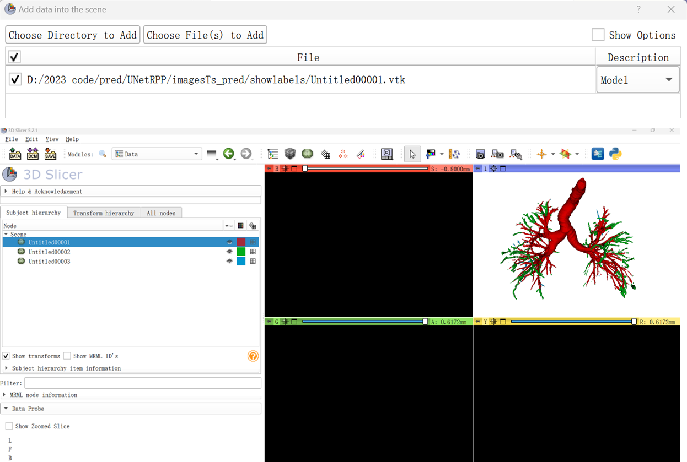
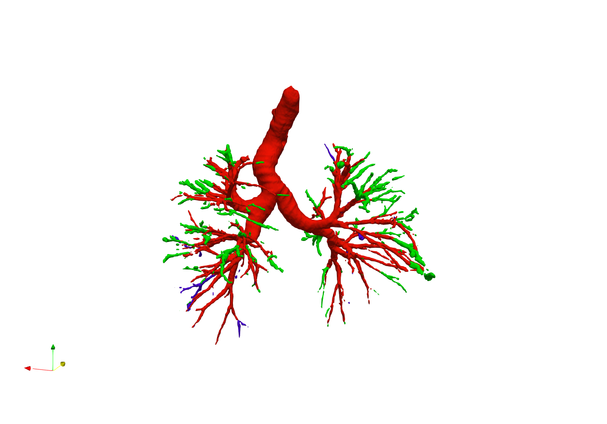

# Tutorial-for-visualization-segmented-airways
Useful links about ITK-SNAP and ParaView: 
https://cloud.tencent.com/developer/article/1631058

## Steps:
### 1. Using ITK-SNAP to export the segmented area as the .vtk files. In this example, we have three labels in red, green, and blue.

### 3D Slicer: Upload the three .vtk files and change their colours one by one. 

### ParaView: Upload the three .vtk files and change their colours one by one. 

### After changing the background color, you can get the fig below:

